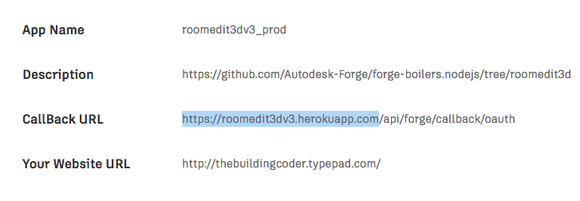
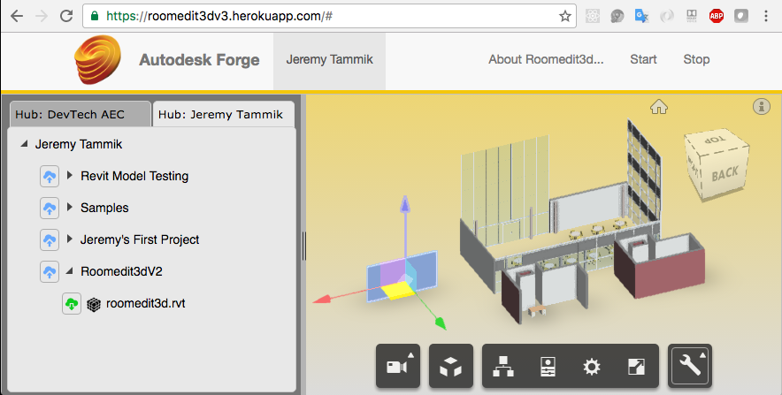

# Roomedit3dv3

## Description

Forge Viewer extension to move building elements and update the Revit BIM in real-time using [socket.io](http://socket.io).

This is a [node.js](https://nodejs.org) web server implementing a Forge Viewer extension.

- [Forge Components](#1)
- [Prerequisites and Sample Setup](#2)
- [Round-Trip BIM Manipulaton via Forge and Roomedit3dv3](#3)
- [Connecting desktop and cloud](#4)
- [Interactive model modification in the Forge Viewer](#5)
- [Communication Back from Viewer Client to Node.js Web Server to Desktop BIM](#6)
- [Authors](#98)
- [License](#99)

## Forge Components

`Roomedit3dv3` is based
on [Philippe Leefsma](http://twitter.com/F3lipek)'s
[`forge-boilers.nodejs` node.js-based boilerplate projects](https://github.com/Autodesk-Forge/forge-boilers.nodejs) for
the [Autodesk Forge Web Services APIs](http://forge.autodesk.com).

The following Forge APIs and components are used to manipuate a Revit BIM model:

- Authenticate and authorise the user &ndash; [Authentication (OAuth)](https://developer.autodesk.com/en/docs/oauth/v2)
- Access and download a RVT project file from A360 &ndash; [Data Management API](https://developer.autodesk.com/en/docs/data/v2)
- Translate and access its geometry and metadata &ndash; [Model Derivative API](https://developer.autodesk.com/en/docs/model-derivative/v2)
- Display to the user &ndash; [Viewer](https://developer.autodesk.com/en/docs/viewer/v2)

Just as Philippe original boilerplate code, this sample illustrates use of the following Forge npm packages:

- [forge.oauth2-js](https://github.com/Autodesk-Forge/forge.oauth2-js)
- [forge.oss-js](https://github.com/Autodesk-Forge/forge.oss-js)
- [forge.model.derivative-js](https://github.com/Autodesk-Forge/forge.model.derivative-js)
- [forge.data.management-js](https://github.com/Autodesk-Forge/forge.data.management-js)

## Prerequisites and Sample Setup

For a full detailed description of the steps required to set up your own Forge account,
install and modify the sample to use your credentials and deploy as a local server or on a platform such
as [Heroku](https://heroku.com),
please refer to Philippe's original documentation for the
boilerplate [prerequisites](https://github.com/Autodesk-Forge/forge-boilers.nodejs#prerequisites)
and [sample setup](https://github.com/Autodesk-Forge/forge-boilers.nodejs#boilers-setup).

In brief:

This project uses [Webpack](https://webpack.github.io) and NPM packages to build and generate the frontend code, so an extra build step is required.

First, `cd` to the appropriate subfolder, in this case `6 - viewer+server+data-mng+derivatives`.

On Mac OSX and Linux, run the following in Terminal:

    > npm install
    > export FORGE_CLIENT_ID=<<YOUR CLIENT ID FROM DEVELOPER PORTAL>>
    > export FORGE_CLIENT_SECRET=<<YOUR CLIENT SECRET>>
    > npm run build-dev (this runs a dev build and webpack in --watch mode)
    > npm run dev (runs the node server, do in another terminal if you want to keep the webpack watcher running)

Under Windows, replace `export` by `set`.

Open your browser at [http://localhost:3000](http://localhost:3000).

<b>Important:</b> the `npm start` command is intended for <b>PRODUCTION</b> with HTTPS (SSL) secure cookies.

To run a production build, you can use start command:

    > npm start

This will run a production build and start the server.

The production build code is minified and function names are mangled, making it smaller and impractical for debugging or reverse engineering.

To download and view files stored in the OSS, you need a valid callback url to achieve 3-legged oauth authentication.
 
I recommend you create two separate sets of Forge API keys, one for DEVELOPMENT and one for PRODUCTION, because each set has a different callback url.

To run the project locally (using the DEV API keys):

- Make sure the callback url for your DEV Forge API Keys is set to <b>http://localhost:3000/api/forge/callback/oauth</b>.

Run the following commands (mind the DEV!):

    > npm install
    > set FORGE_DEV_CLIENT_ID=<<YOUR DEV CLIENT ID FROM DEVELOPER PORTAL>>
    > set FORGE_DEV_CLIENT_SECRET=<<YOUR DEV CLIENT SECRET>>
    > npm run build-dev
    > npm run dev

To run in production, the callback url defined for your Forge App needs to match the host url, so, for example, if you run your app from <b>https://mydomain.com</b>:

    > npm install
    > set HOST_URL=https://mydomain.com
    > set FORGE_CLIENT_ID=<<YOUR CLIENT ID FROM DEVELOPER PORTAL>>
    > set FORGE_CLIENT_SECRET=<<YOUR CLIENT SECRET>>
    > npm start

To deploy this project to Heroku, click on the button below at the Heroku Create New App page:

- Set your Client ID & Client Secret with your Forge API keys.
- Specify the HOST_URL env variable based on the name of your Heroku App, e.g., `MyApp` would map to `HOST_URL=https://MyApp.herokuapp.com`.
- Your Forge App callback must be set to <b>https://MyApp.herokuapp.com/api/forge/callback/oauth</b>.

The result will look like this, displaying a treeview of your Autodesk Cloud storage that lets you upload designs, perform actions from the context menu, start the roomedit3d viewer extension, select and translate model elements:

To load and edit a design in the viewer and see the modifications applied in real-time to the Revit BIM:

- Install the [Roomedit3dApp](https://github.com/jeremytammik/Roomedit3dApp) Revit add-in and ensure it is running.
- Load a model that you have stored in A360 in in Revit.
- Right-click the nodes to get options from the context menu.
- If not already done:
    - Upload a design file to a folder (supports file selection dialog or drag & drop).
    - Upon successful upload, the file appears under the parent node in the tree; right-click it and select <b>Generate viewable</b>.
- Upon successful translation of the design, double-click the file to load it into the viewer.
- Click `Start` to load the roomedit3d viewer extension. Its icon appears with a pull-up menu.
- In Revit, launch the Roomedit3dApp command to subscribe to `transform` notifications.
- Select the transform pull-up icon to start the translate tool.
- Select an element and move it on the screen.

The element position will be updated accordingly in the BIM.

## Round-Trip BIM Manipulaton via Forge and Roomedit3dv3

The `roomedit3dv3` viewer extension enables interactive selection and movement of selected BIM elements in the model on screen.

The updated elements and their new locations are transferred back from the viewer client to the web server via a REST API call.

The server in turn uses [socket.io](http://socket.io) to broadcast the updates to the rest of the universe.

This broadcast is picked up by the [Roomedit3dApp](https://github.com/jeremytammik/Roomedit3dApp) C# .NET Revit add-in client.

This version supersedes its precursor [roomedit3d](https://github.com/jeremytammik/roomedit3d), which was hardwired for a specific model.

In `roomedit3dv3`, any model can be selected.

Todo: add a project identifier to the broadcasts to enable the C# add-in broadcoast receivers to ignore all messages not pertaining to the current Revit BIM.

The selected element is identified via its Revit UniqueId.

## Connecting Desktop and Cloud

`Roomedit3dv3` is a member of the suite of samples connecting the desktop and the cloud.

Each of the samples consists of a C# .NET Revit API desktop add-in and a web server:

- [RoomEditorApp](https://github.com/jeremytammik/RoomEditorApp) and  the [roomeditdb](https://github.com/jeremytammik/roomedit) CouchDB
	database and web server demonstrating real-time round-trip graphical editing of furniture family instance location and rotation plus textual editing of element properties in a simplified 2D representation of the 3D BIM.
- [FireRatingCloud](https://github.com/jeremytammik/FireRatingCloud) and
	the [fireratingdb](https://github.com/jeremytammik/firerating) node.js
	MongoDB web server demonstrating real-time round-trip editing of Revit element shared parameter values.
- [Roomedit3dApp](https://github.com/jeremytammik/Roomedit3dApp) and
  the first [roomedit3d](https://github.com/jeremytammik/roomedit3d) Forge Viewer extension demonstrating translation of furniture family instances in the viewer and updating the Revit BIM in real time via a socket.io broadcast with a hard-coded sample model.
- [Roomedit3dApp](https://github.com/jeremytammik/Roomedit3dApp) and
  the [roomedit3dv3](https://github.com/jeremytammik/roomedit3d) Forge Viewer extension demonstrating the same functionality with a user selected model stored in A360.

## Interactive Model Modification in the Forge Viewer

The `Roomedit3dTranslationTool` implements a viewer extension that enables the user to select a component and interactively move it around on the screen, defining a translation to be applied to it and communicated back to the source CAD model.

## Communication Back from Viewer Client to Node.js Web Server to Desktop BIM

The Forge Viewer itself provides viewing functionality only, no editing.

The pre-defined Forge communication path is one-way only, from the desktop to the cloud, from the source 'seed' CAD model to the translated Forge API bucket and JSON data bubble stream.

This sample demonstrates an interactive modification of the [three.js](http://threejs.org) graphics presented by the viewer and a communication path to send updated element location information back to the desktop product in real time.

In this case, the source desktop CAD model is a Revit BIM, and the modifications applied are building element translations.

The viewer client in the browser uses [fetch](https://github.com/github/fetch) to implement a REST API POST call to communicate the modified element external id and translation back to the node.js server.

The node.js server uses a [socket.io](http://socket.io) broadcast to notify the desktop of the changes.

The dedicated C# .NET Revit add-in [Roomedit3dApp](https://github.com/jeremytammik/Roomedit3dApp) subscribes to the socket.io channel, retrieves the updating data and raises an external event to obtain a valid Revit API context and apply it to the BIM.

## Authors

- [Philippe Leefsma](http://adndevblog.typepad.com/cloud_and_mobile/philippe-leefsma.html),
[Autodesk](http://www.autodesk.com) [Forge Partner Development](http://forge.autodesk.com)
- Jeremy Tammik,
[The Building Coder](http://thebuildingcoder.typepad.com) and
[The 3D Web Coder](http://the3dwebcoder.typepad.com),
[ADN](http://www.autodesk.com/adn)
[Open](http://www.autodesk.com/adnopen),
[Forge Partner Development](http://forge.autodesk.com),
[Autodesk Inc.](http://www.autodesk.com)

## License

This sample is licensed under the terms of the [MIT License](http://opensource.org/licenses/MIT).
Please see the [LICENSE](LICENSE) file for full details.

