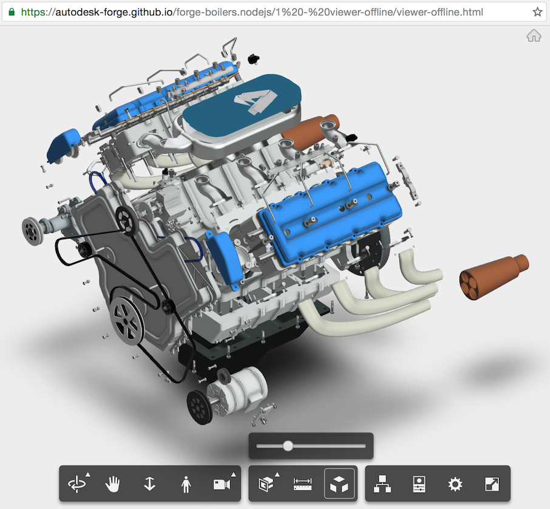
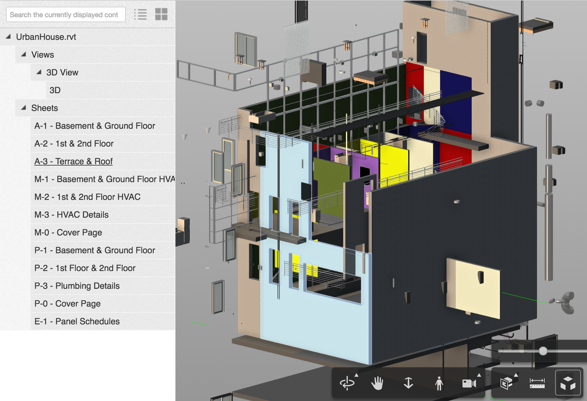
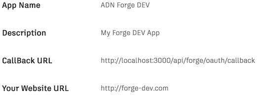
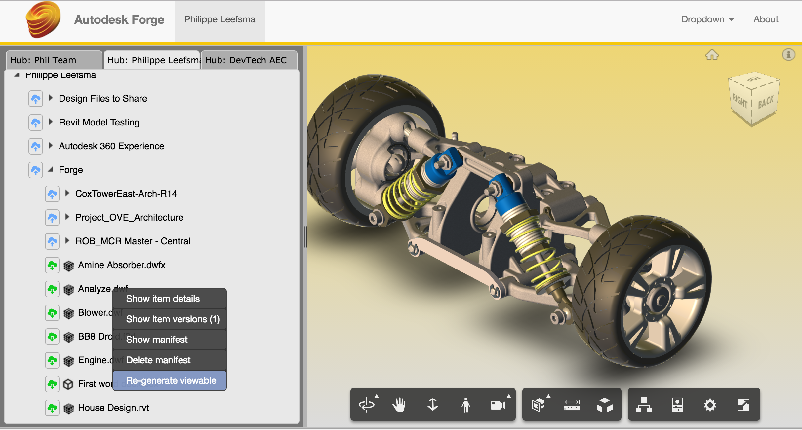

# Forge Node.js Boilers

## Description
A collection of node.js-based boiler projects for the [Autodesk Forge Web Services APIs](http://forge.autodesk.com).

Those samples illustrates how to use the following Forge npm packages:

 * [forge.oauth2-js](https://github.com/Autodesk-Forge/forge.oauth2-js)
 * [forge.oss-js](https://github.com/Autodesk-Forge/forge.oss-js)
 * [forge.model.derivative-js](https://github.com/Autodesk-Forge/forge.model.derivative-js)
 * [forge.data.management-js](https://github.com/Autodesk-Forge/forge.data.management-js)

## Prerequisites

To run those samples, you need your own Forge API credentials:

 * Visit the [Forge Developer Portal](https://developer.autodesk.com), sign up for an account
 * [Create a new App](https://developer.autodesk.com/myapps/create)
 * For this new App, you can use <b>http://localhost:3000/api/forge/callback/oauth</b> as Callback URL.
 * Take note of the <b>Client ID</b> and <b>Client Secret</b>, those are your API keys that must remain hidden
 * Install the latest release of [NodeJS](https://nodejs.org)
 * Clone this or download this project. It's recommended to install a git client such as [GitHub desktop](https://desktop.github.com/) or [SourceTree](https://www.sourcetreeapp.com/)
 * To clone it via command line, use the following (<b>Terminal</b> on MacOSX/Linux, <b>Git Shell</b> on Windows):

    > git clone https://github.com/Autodesk-Forge/forge-boilers.nodejs

## Boilers Setup

Below are instructions to setup and run locally each boiler project, they may vary based on which project you want to run.

## Project #1 - viewer-offline

You can simply open <b>viewer-offline.html</b> in a browser. This project will load the local model from <b>/v8</b> directoryand  does not require you to run any server on the machine,
although you may want to serve the .html page to get around security restrictions imposed by some browsers (such as Chrome) when reading local files.

 * In order to do that install a local http server on your machine, you can use the following:

    > sudo npm install -g http-server

 * Navigate to <b>"/1 - viewer-offline"</b> directory and start the server:

    > http-server

 * Note the local address output by the server (ex: <b>http://127.0.0.1:8080</b>) and type in your browser: <b>http://127.0.0.1:8080/viewer-offline.html</b>

 * This project does not require any internet connection or Forge API credentials and can be used for testing the viewer API locally

 * You can also run that sample the following links, which in that case requires an internet connection:

    * [Engine](https://autodesk-forge.github.io/forge-boilers.nodejs/1%20-%20viewer-offline/viewer-offline.html)
    * [Copter](https://autodesk-forge.github.io/forge-boilers.nodejs/1%20-%20viewer-offline/viewer-offline.html?path=./copter/0.svf)

## Project #2 - viewer-barebone

Samples in this project do not require you to implement a server, but they rely on hardcoded token and URN in the JavaScript code, so they are for testing purpose only.

 * You will need to generate a valid [2-legged OAuth token](https://developer.autodesk.com/en/docs/oauth/v2/tutorials/get-2-legged-token/) and upload a model to your account, which you can do using that website for now: [https://models.autodesk.io](https://models.autodesk.io)

 * Once you have a token and the URN of your model, replace in the hardcoded fields in <b>viewer.html</b> and <b>viewingApp.html</b>:

     var token = '<< Place your token here >>'

     var urn = '<< Place your URN here >>'

 * You can open the files directly in browser or serve similar to project #1. The <b>viewer.html</b> is using the plain JavaScript viewer API,
 whereas <b>viewingApp.html</b> is using an extra layer of code from Autodesk which adds a UI to switch between viewables (for designs translated from Revit .rvt files), see screenshot below:

 

## Project #3 - viewer+server
## Project #4 - viewer+server+oss
## Project #5 - viewer+server+oss+derivatives

The setup is similar for those 3 projects and they have to be run independently.

Those projects are using [Webpack](https://webpack.github.io), a module bundler and NPM packages to build and generate the frontend code, so an extra build step is required.

Navigate with a command shell or terminal to the project you want to run and type the following commands:

Mac OSX/Linux (Terminal)

    > npm install
    > export FORGE_CLIENT_ID=<<YOUR CLIENT ID FROM DEVELOPER PORTAL>
    > export FORGE_CLIENT_SECRET=<<YOUR CLIENT SECRET>
    > npm run build-dev (this runs a dev build and webpack in --watch mode)
    > npm run dev (runs the node server, do in another terminal if you want to keep the webpack watcher running)

Windows (use <b>Node.js command line</b> from Start menu)

    > npm install
    > set FORGE_CLIENT_ID=<<YOUR CLIENT ID FROM DEVELOPER PORTAL>
    > set FORGE_CLIENT_SECRET=<<YOUR CLIENT SECRET>
    > npm run build-dev
    > npm run dev

Open your browser at:
[http://localhost:3000](http://localhost:3000)

<b>Important:</b> the <b>npm start</b> command, this is intended for <b>PRODUCTION</b> with HTTPS (SSL) secure cookies.

To run a production build, you can use command

    > npm run build-prod

Or simply

    > nmp start

Which will run a production build and start the server. A production build code is minified and function names are mangled which make it much smaller and impractical for debugging or reverse engineering.

### Deploy Project #5 on Heroku

To deploy this project to Heroku, simply click on the button below, at the Heroku Create New App page:

 * Set your Client ID & Client Secret with your Forge API keys

The result will look like below: a treeview of the OSS storage that lets you upload designs and perform actions from the context menu.

To load a design in the viewer:

 * Right-click the root node to create a new bucket if you do not have any
 * Upload the design file to the bucket
 * Upon successful upload, the file appears in the bucket, right-click and select <b>Generate viewable</b>
 * Upon successful translation of the design, double-click the file and it will get loaded in the viewer

 

## Project #6 - viewer+server+data-mng+derivatives

Same setup than for projects #3, #4, #5 but you also need a valid callback url to achieve 3-legged oauth authentication.
I recommend you create 2 sets of Forge API keys, one for DEVELOPMENT and one for PRODUCTION because each set has a different callback url

To run the project locally (using the DEV API keys):

 * Make sure the callback url for your DEV Forge API Keys is set to <b>http://localhost:3000/api/forge/callback/oauth</b>
 * Run the following commands:

     > npm install
     > set FORGE_DEV_CLIENT_ID=<<YOUR DEV CLIENT ID FROM DEVELOPER PORTAL>
     > set FORGE_DEV_CLIENT_SECRET=<<YOUR DEV CLIENT SECRET>
     > npm run build-dev
     > npm run dev

 

To run in production, the callback url defined in your Forge App needs to match the host url, so if you run your app from <b>mydomain.com</b>:

    > npm install
    > set HOST_URL=mydomain.com
    > set FORGE_CLIENT_ID=<<YOUR CLIENT ID FROM DEVELOPER PORTAL>
    > set FORGE_CLIENT_SECRET=<<YOUR CLIENT SECRET>
    > npm run build-dev
    > npm run dev

### Deploy Project #6 on Heroku

To deploy this project to Heroku, simply click on the button below, at the Heroku Create New App page:

 * Set your Client ID & Client Secret with your Forge API keys
 * Specify HOST_URL env variable based on the name of your Heroku App: ex You used "MyApp" -> HOST_URL=https://MyApp.herokuapp.com

The result will look like below: a treeview of your Autodesk Cloud storage that lets you upload designs and perform actions from the context menu.

To load a design in the viewer:

 * Right-click the nodes to get options from the context menu
 * Upload a design file to a folder
 * Upon successful upload, the file appears under the parent node in the tree, right-click and select <b>Generate viewable</b>
 * Upon successful translation of the design, double-click the file and it will get loaded in the viewer

 

# Tips & tricks

For local development/testing, consider use [nodemon](https://www.npmjs.com/package/nodemon) package, which auto restarts your node application after any modification on your code. To install it, use:

    sudo npm install -g nodemon

Then, instead of <b>npm run dev</b>, use the following:

    npm run nodemon

Which executes <b>nodemon bin/run.js --config nodemon.js</b>, where the <b>nodemon.js</b> is the nodemon config file where you can define which directories and file types are being watched, along with other configuration options.
See [nodemon](https://github.com/remy/nodemon) for more details.

## License

[MIT License](http://opensource.org/licenses/MIT)

## Written by 

Written by [Philippe Leefsma](http://twitter.com/F3lipek)

Forge Partner Development
[http://forge.autodesk.com](http://forge.autodesk.com)

